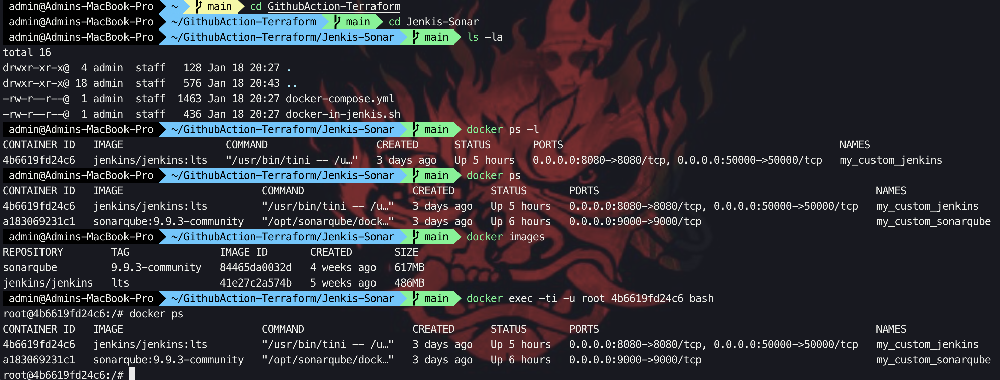
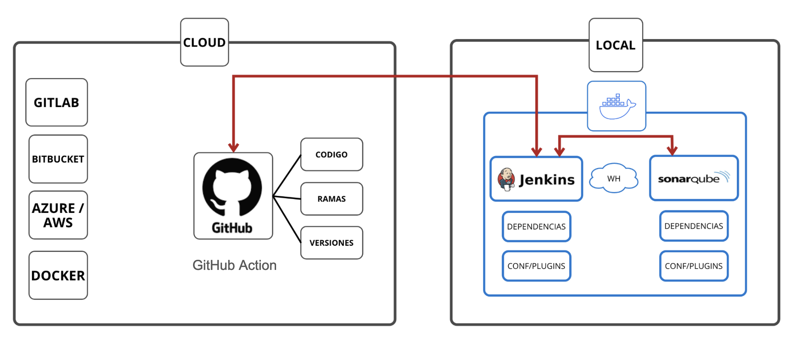
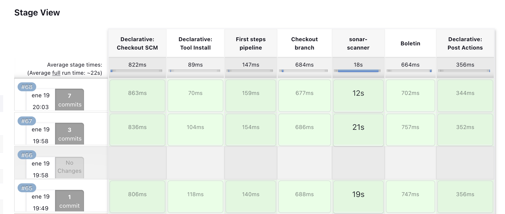

# Autor


xxtochoxx@gmail.com

[linkedin](https://www.linkedin.com/in/humberto-melendez-fernandez)

# Jenkins - Sonarqube & Docker (github-action)

Estoy aportando a la comunidad una muestra de integración con docker usando Jenkis y Sonarqube , como primera etapa se debe tener en cuenta que debemos tener instalado docker compose.

Los contenemos van a estar en una sola red virtualizada para que puedan integrarse facilmente.

Los plugins de cada componente deben instalar manualmente (depende del uso),las dependencias de base de datos son parte de la imagen del contenedor.

Adicionalmente se agrega un ejemnplo puntual sobre el uso de githubactions - saber la fecha y hora de la ejecución de un request.

## Instalación

```bash
git clone https://github.com/xxtochoxx/GithubAction-Terraform.git
cd GithubAction-Terraform
cd Jenkins-Sonar
```
Revisar que el compose pueda ejecutarse,luego listar las imagenes desplegadas
```bash
docker-compose up
docker ps
docker images
```
```bash
La clave por defecto de Sonarqube es admin:admin ⚓
```
```bash
La clave de Jenkis lo encontramos en lo logs del mismo servidor  🖥️
```

Revisar que en el contenedor Jenkins se ejecute docker ps

## Plugins & dependencias


```bash
Instalar plugins de sonarqube de acuerdo a su requerimiento.

```
```bash
Instalar plugins de jenkis de acuerdo a su requerimiento.
```

```bash
los valores por default, dependiendo de la versión, son localhost.
```


## Ejecución del reporte

```python
Se debe cambiar los valores de las credenciales que contiene el archivo Jenkisfile

# cambiar branches de acuerdo a su requerimiento- url
checkout([$class: 'GitSCM', branches: [[name: '*/main']], extensions: [], userRemoteConfigs: [[url: 'https://github.com/xxtochoxx/GithubAction-Terraform']]])

# cambiar admin de acuerdo a su requerimiento
Dsonar.login='admin'

# cambiar password de acuerdo a su requerimiento
Dsonar.password='#Cr1pt0m0n3d4#'
```
## :hammer:Configuraciones manuales

```bash
Sonarqube
```
- `Administration`: server base url http://mysonarqube:9000-
- `Marketplace`: Instalar plugins a usar (nodejs - python - php)-
- `Administration `: Configuration webhooks // insertar http://myjenkins:8080/sonarqube-webhook-

```bash
Jenkins
```
- `MANAGE JENKIS`: PLUGINS instalar sonarqube scanner  // quelity gates // nodejs // python-
- `Tool`: configurar sonarqube // nodejs // python-
- `System `: Configuration Jenkins location // Sonarqube servers // Quality Gates-


En cada stage del jenkis se revisara el estado de cada paso, luego se revisare en sonarqube

## Diagrama de componentes


## Dashboard de Jenkins


## Dashboard de Sonar

