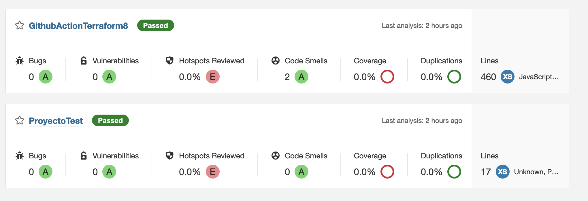

# Autor

Humberto Melendez 

xxtochoxx@gmail.com

[linkedin](https://www.linkedin.com/in/humberto-melendez-fernandez)

# Jenkis - Sonarqube & Docker

Estoy aportando a la comunidad una muestra de integración con docker usando Jenkis y Sonarqube , como primera etapa se debe tener en cuenta que debemos tener instalado docker compose.

Los contenemos van a estar en una sola red virtualizada para que puedan integrarse facilmente.

Los plugins de cada componente deben instalar manualmente (depende del uso),las dependencias de base de datos son parte de la imagen del contenedor.

## Instalación

```bash
git clone https://github.com/xxtochoxx/GithubAction-Terraform.git
cd GithubAction-Terraform
cd Jenkis-Sonar
```
Revisar que el compose pueda ejecutarse,luego listar las imagenes desplegadas
```bash
docker-compose up
docker ps
docker images
```
Ingresar al contenedor de Jenkis por medio de su *CONTAINER ID* del comando docker ps

```bash
docker exec -ti -u root *CONTAINER ID* bash
```

Ingresar a la ruta GithubAction-Terraform/Jenkis-Sonar/docker-in-jenkis.sh

```bash
pbcopy docker-in-jenkis.sh
```
Revisar que en el contenedor Jenkins se ejecute docker ps

## Plugins & dependencias


```bash
Instalar plugins de sonarqube de acuerdo a su requerimiento.

```
```bash
Instalar plugins de jenkis de acuerdo a su requerimiento.
```

```bash
los valores por default, dependiendo de la versión, son localhost.
```


## Ejecución del reporte

```python
Se debe cambiar los valores de las credenciales que contiene el archivo Jenkisfile

# cambiar branches - url
checkout([$class: 'GitSCM', branches: [[name: '*/main']], extensions: [], userRemoteConfigs: [[url: 'https://github.com/xxtochoxx/GithubAction-Terraform']]])

# cambiar admin
Dsonar.login='admin'

# cambiar password
Dsonar.password='#Cr1pt0m0n3d4#'
```
En cada stage del jenkis se revisara el estado de cada paso, luego se revisare en sonarqube

## Diagrama de componentes


## Dashboard de jenkins

## Dashboard de sonar

